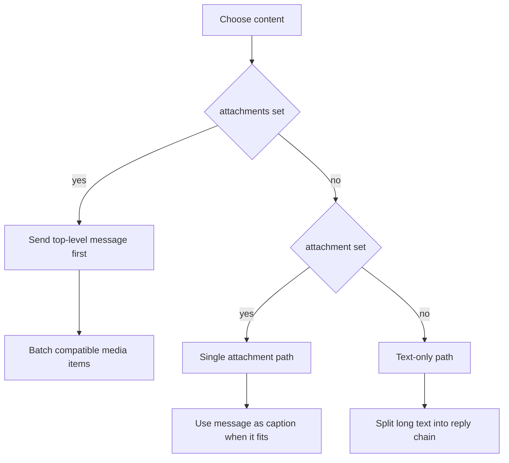

# Sending Paths

This project has three real transport paths: text only, a single attachment, or a batch of attachment items.

## Routing overview

## Text only

Use this path when the workflow only sends text.

Supported sources:

- `message`
- `message_file`
- `message_url`

Long messages are split automatically. Each later chunk replies to the previous chunk, and buttons are attached to the final chunk only.

## Buttons

The `buttons` field accepts either:

- a flat array for one row
- a nested array for multiple rows

Each button must include `text` and exactly one Telegram action field such as `url`, `callback_data`, or `web_app`.

Buttons are not an independent send mode. They always ride on a text message or a caption-capable single attachment.

## Single attachment

Use `attachment` together with `attachment_type`.

Supported sources:

- local file path
- public URL
- Telegram file ID

Supported types:

- `photo`
- `video`
- `audio`
- `animation`
- `document`

The `message` field becomes the caption only when the formatted text still fits Telegram's caption limit. Otherwise the action sends leading text chunks first and then sends the attachment.

`attachment_filename` only works for local file uploads.

`supports_streaming` only works for a single `video` attachment.

## Attachment batches

Use `attachments` when several media items belong to one run.

Each item supports:

- `type`
- `source`
- optional `filename`
- optional `caption`
- optional `supports_streaming` for video items

Top-level `message` is sent first as a separate text message. That keeps long text safe to split and still leaves room for buttons on the text part.

Batching rules:

- 1 item falls back to the single attachment path
- 2 to 10 compatible items are sent as one media group
- more than 10 items are split into multiple batches in order
- `animation` cannot join a media group and is sent on its own

## Topics, replies, and channels

- `TELEGRAM_TOPIC_ID` routes the send into a forum topic
- `TELEGRAM_REPLY_TO_MESSAGE_ID` replies to an existing message
- channel comments are controlled in Telegram channel settings, not by a message-level action input
