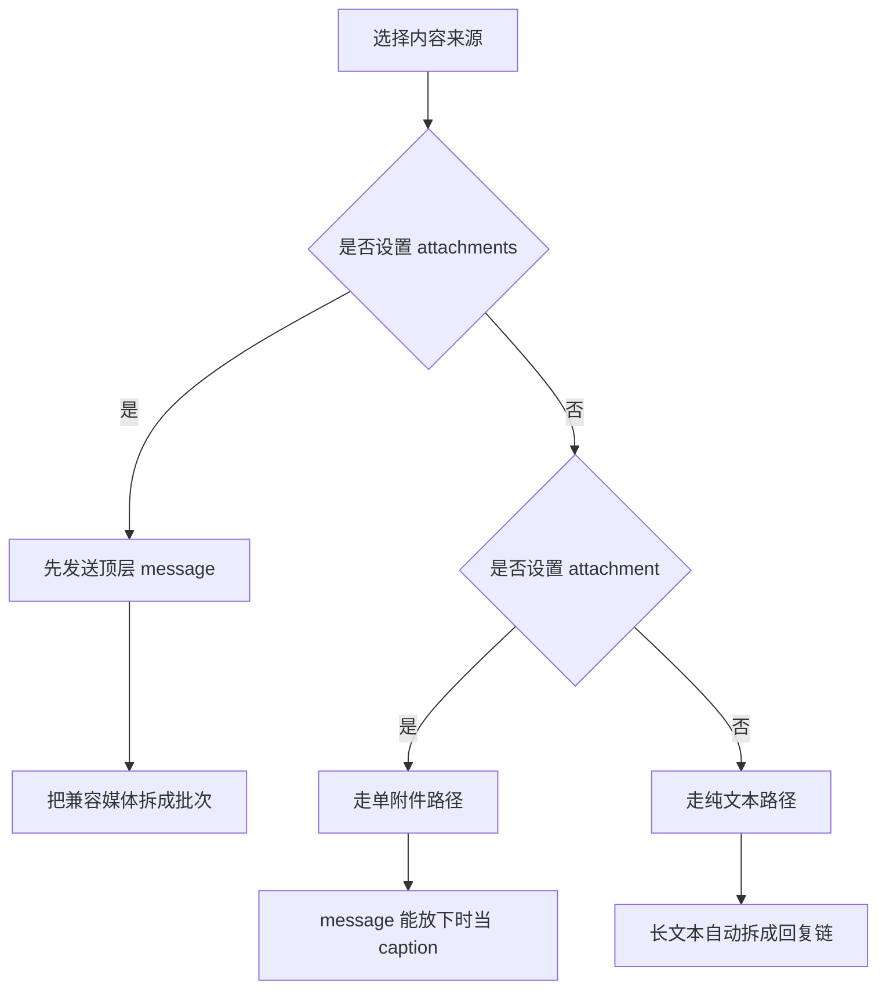

# 发送路径

这套项目实际只有三条发送路径：纯文本、单附件、多附件批次

## 路径总览

## 纯文本路径

适合只发文本的场景

正文来源有三种：

- `message`
- `message_file`
- `message_url`

消息太长时会自动拆分，后面的分片会回复前一片，按钮只挂在最后一片上

## 按钮

`buttons` 接受两种结构：

- flat 数组，表示单行
- nested 数组，表示多行

每个按钮都要带 `text`，同时只能带一个 Telegram 行为字段，例如 `url`、`callback_data`、`web_app`

按钮还可以带 `style`，可用值有：

- `primary`
- `success`
- `danger`

按钮不是独立发送模式，它总是附着在文本消息或者支持 caption 的单附件上

## 单附件路径

单附件用 `attachment` 配合 `attachment_type`

来源可以是：

- 本地文件路径
- 公开 URL
- Telegram file ID

支持的类型有：

- `photo`
- `video`
- `audio`
- `animation`
- `document`

`message` 只有在格式化后仍然塞得进 Telegram caption 限制时，才会直接作为 caption

放不下时，Action 会先把前面的正文分片发出去，再发送附件

`attachment_filename` 只对本地上传有效

`supports_streaming` 只对单个 `video` 附件有效

## 多附件批次

多个媒体条目一起发送时，用 `attachments`

每个条目支持这些字段：

- `type`
- `source`
- 可选 `filename`
- 可选 `caption`
- 视频条目可选 `supports_streaming`

顶层 `message` 会先作为独立文本消息发送，这样长文本还能安全拆分，按钮也还能挂在文本消息上

批次规则是：

- 1 个条目会退回单附件路径
- 2 到 10 个兼容条目会组成一个 media group
- 超过 10 个条目会按顺序拆成多个批次
- `animation` 不能进入 media group，所以会单独发送

## 话题、回复和频道

- `TELEGRAM_TOPIC_ID` 用来投递到论坛话题
- `TELEGRAM_REPLY_TO_MESSAGE_ID` 用来回复现有消息
- 频道评论区由 Telegram 频道设置控制，不是消息级别的 Action 开关
